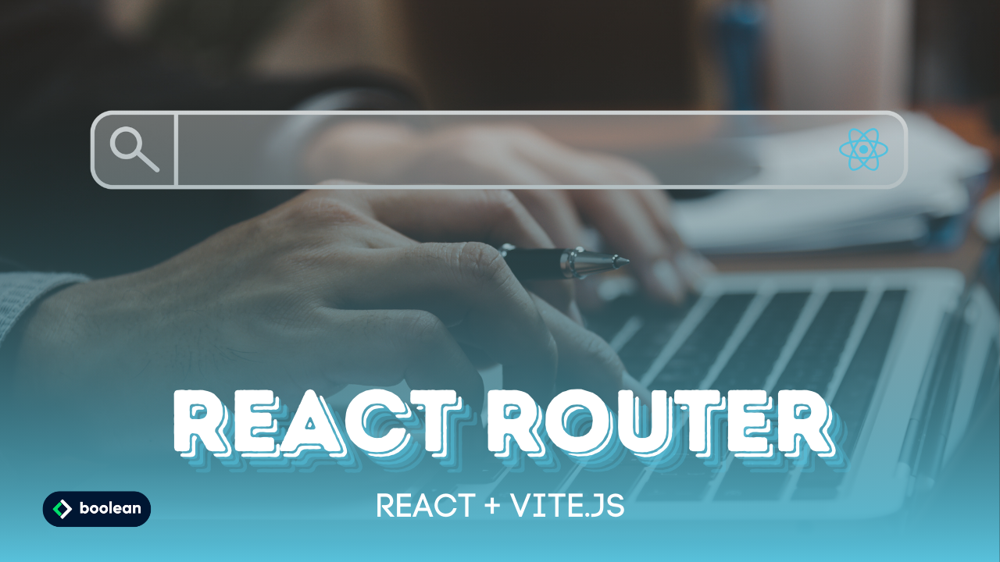

 
Esercizio #40 | Classe 137 | Boolean Academy

---

Studente: Fabio Ferrero

---
# English

## Target of the project:
Let's create the frontend of our Blog and its pages:

- We start by installing React Router DOM: npm install react-router-dom.
- We define at least 3 pages: a homepage, an “about us” page and a page with the list of posts
- We implement a navbar in common to all pages in order to navigate between them

**Bonus**

- Centralize the Navbar thanks to a Layout
- Manage the active class
- Print the menu dynamically

---
# Italiano

## Obiettivo del progetto:
Creiamo il frontend del nostro Blog e le sue pagine:

- Partiamo installando React Router DOM: npm install react-router-dom
- Definiamo almeno 3 pagine: una homepage, una pagina “chi siamo” e una pagina con la lista dei post
- Implementiamo una navbar in comune a tutte le pagine per poter navigare tra loro

**Bonus**

- Centralizzare la Navbar grazie a un Layout
- Gestire la classe active
- Stampare il menu dinamicamente

---

